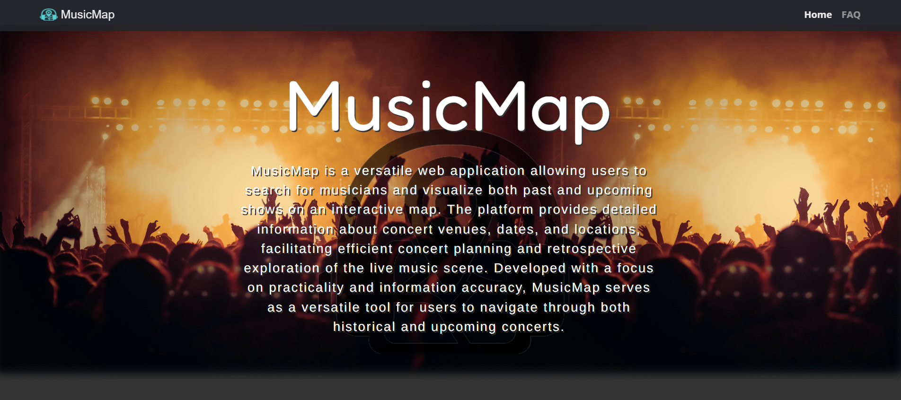
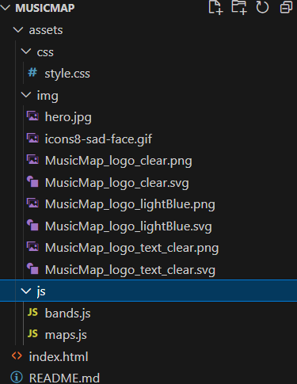

# MusicMap - Web Application

## Overview

MusicMap is a web application designed to enhance the user's experience in exploring the concert history and upcoming shows of their favorite musicians. This README provides an overview of the application's features, functionality, and technical aspects.

## Features

1. **Artist Search and Visualization:**
   - Users can search for musicians and visualize their past and upcoming concerts on an interactive map.

2. **Toggle Between Past and Upcoming Events:**
   - Toggle functionality allows users to seamlessly switch between an artist's historical performances and their upcoming shows.

3. **Social Media Integration:**
   - Social media links for each artist are displayed, providing users with direct access to the artist's official profiles for the most accurate and up-to-date information.

4. **Mobile-Friendly Design:**
   - The application is optimized for mobile devices, ensuring a responsive and user-friendly experience on smartphones and tablets.

5. **Free Access:**
   - MusicMap is a free-to-use platform, eliminating any subscription fees or hidden charges for users.

6. **Concert Details:**
   - Detailed information about each concert, including venue, date, and location, is accessible by clicking on individual events.

## Usage

### Searching for Artists

1. Enter the name of the desired musician in the search bar.
2. Explore the interactive map displaying the artist's past and upcoming concerts.
3. Toggle between past and upcoming events for a comprehensive view.

### Social Media Links

1. View the displayed social media links associated with each artist.
2. Click on the links to access the official social media profiles for accurate and real-time information.

## Technology Stack

- **Frontend:**
  - HTML, CSS, JavaScript
  - [jQuery](https://jquery.com/) - Fast, small, and feature-rich JavaScript library.
  - [Bootstrap](https://getbootstrap.com/) - Open-source CSS framework for building responsive and mobile-first websites.
  - [Google Fonts](https://fonts.google.com/) - Library of free and open-source fonts.

- **APIs:**
  - [GoogleMaps API](https://developers.google.com/maps) or [Bands In Town API](https://artists.bandsintown.com/support/api-installation) for interactive map functionality.

## Accessing the Website

### Searching for Artists

1. Open the MusicMap web application in your preferred web browser.

2. In the search bar at the top of the page, enter the name of the musician or band you want to explore.

3. As you type, the application will provide autocomplete suggestions to help you find the desired artist quickly.

4. Press "Enter" or click on the artist's name from the suggestions to initiate the search.

5. The interactive map will update to display the past and upcoming concerts for the selected artist.

### Exploring Concerts on the Map

1. Once the artist's concerts are displayed on the map, you can zoom in and out to explore different regions.

2. Click on individual markers to view detailed information about each concert, including the venue, date, and location.

3. Use the toggle functionality to switch between viewing past and upcoming events for a comprehensive overview of the artist's concert history.

### Accessing Social Media Links

1. Social media links associated with the selected artist will be displayed on the page.

2. Click on the provided links to access the official social media profiles for the artist.

3. Explore the artist's social media pages for the latest updates, announcements, and additional information.

### Mobile-Friendly Experience

1. MusicMap is optimized for mobile devices, providing a seamless and responsive experience on smartphones and tablets.

2. Access the application on the go to stay connected with your favorite artists and their concert schedules.

### Contributing and Providing Feedback

1. We value feedback from our users. If you encounter any issues, have suggestions, or want to contribute to the project, please consider opening an issue or submitting a pull request on our GitHub repository.

2. Your input helps us improve MusicMap and provide a better experience for the community.

Enjoy exploring the world of live music with MusicMap!

## File Structure

This project follows a straightforward file structure to help you navigate and contribute effectively. Below is an overview of the key directories and files:

- **`/css`:** Contains the CSS stylesheets for the application.
- **`/js`:** Includes JavaScript files, with specific functionalities organized accordingly.
- **`/img`:** Houses image assets used in the application.
- **`index.html`:** The main HTML file serving as the entry point to the MusicMap web application.
- **`README.md`:** The file you are currently reading, providing essential information about the project.

Feel free to explore these directories to understand the project structure better and make contributions more efficiently.

## Credits/References

* **Google Map Markers:** https://github.com/googlemaps/js-markerclusterer
* **Maps on GitHub:** https://stackoverflow.com/questions/45117542/does-google-maps-api-work-on-github-pages
* **Accessibility Checklist for FE Developers:** https://holistica11y.com/accessibility-checklist-for-front-end-developers/
    * * **Bootstrap Built-in Accessibility:** https://getbootstrap.com/docs/4.0/getting-started/accessibility/#:~:text=The%20overall%20accessibility%20of%20any,and%20scripting%20they've%20included.
    * * **Maps Window Accessibility:** https://support.google.com/maps/answer/6396990?hl=en&co=GENIE.Platform%3DDesktop&oco=0

## Collaborators

* **Greg Duke:**
  - GitHub: [SatsumaSegment](https://github.com/SatsumaSegment)
* **Hansal Vaikkath:**
  - GitHub: [09hanvaik](https://github.com/09hanvaik)
* **Moh Zaman:**
  - GitHub: [Moh-Zaman](https://github.com/Moh-Zaman)
* **Emma Blencowe:**
  - GitHub: [embleem](https://github.com/embleem)

## Future Development

Our development team is actively working on enhancing MusicMap. Future updates may include additional features based on user feedback and evolving requirements.

## Feedback and Contribution

We welcome feedback and contributions from the community. If you encounter issues or have suggestions, please open an issue or submit a pull request.

Enjoy exploring the world of live music with MusicMap!
